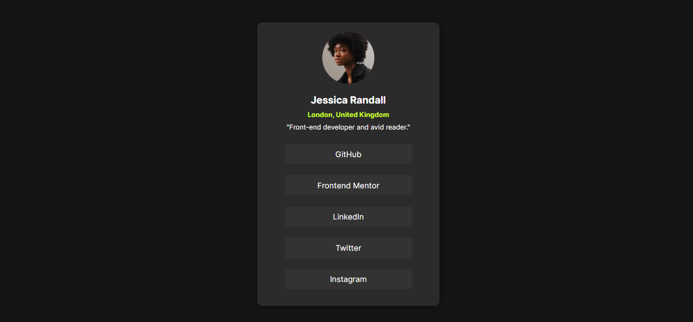

# Frontend Mentor - Social links profile solution

This is a solution to the [Social links profile challenge on Frontend Mentor](https://www.frontendmentor.io/challenges/social-links-profile-UG32l9m6dQ).  
Frontend Mentor challenges help you improve your coding skills by building realistic projects.

---

## 📸 Screenshot



---

## 🔗 Links

- **Solution URL:** [https://www.frontendmentor.io/solutions/social-links-profile-card-TU1Pa3LO6j](#)
- **Live Site URL:** [https://fransantos103.github.io/frontendMentorEasy-social-links-profile/](#)

---

## 💻 My process

### Built with
- Semantic **HTML5** markup  
- **CSS3** (Flexbox, hover states, custom fonts)  
- Responsive design principles  

---

## 🧠 What I learned

While working on this project, I reinforced my understanding of:
- Using **semantic HTML** (`<main>`, `<nav>`, headings)
- Creating **centered layouts** with Flexbox  
- Designing **consistent color palettes and hover effects**

Here’s a little code snippet I’m proud of:
```css
a:hover {
  background-color: #c6f82e;
  color: black;
  transition: background-color 0.3s ease, color 0.3s ease;
}
